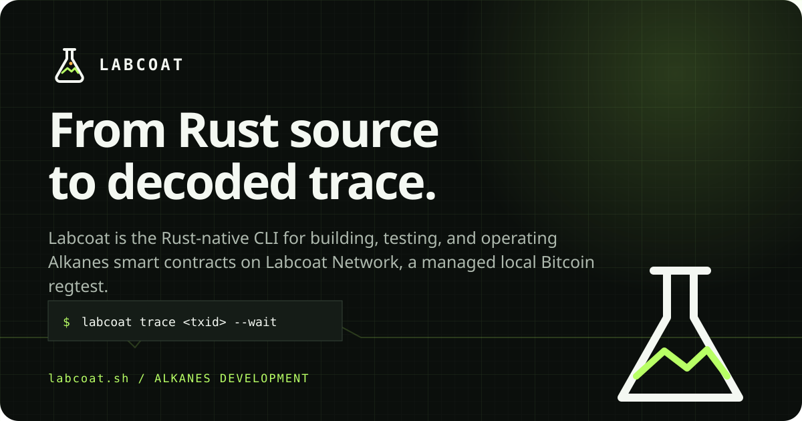

# Labcoat



**From Rust source to decoded trace.**

Labcoat is the Rust-native CLI for building, testing, and operating Alkanes smart contracts on Labcoat Network, a managed local Bitcoin regtest.

> Early-stage software for local Alkanes development. Interfaces may change before 1.0; mainnet deployment controls are not production-ready.

Labcoat provides one command system for scaffolding Rust contracts, native
tests, WebAssembly builds, Labcoat Network, wallets, deployment, calls, atomic
two-wallet exchanges, simulation, traces, JSON automation, and MCP.

**Labcoat Network is Labcoat's local, private, resettable Alkanes network. It
runs Bitcoin regtest under the hood. It is not Signet.**

[Website](https://labcoat.sh) · [Documentation](https://labcoat.sh/docs/) ·
[Agent index](https://labcoat.sh/llms.txt) · [Security policy](SECURITY.md)

## Install

```bash
curl -fsSL https://labcoat.sh/install | sh
labcoat doctor
```

The installer verifies the published SHA-256 checksum and writes `labcoat` to
`${LABCOAT_INSTALL_DIR:-$HOME/.local/bin}`. Install or roll back to an exact
version with:

```bash
curl -fsSL https://labcoat.sh/install | sh -s -- 0.1.0
```

CLI binaries are available for macOS and Linux on arm64 and x86_64. The Labcoat
Network runtime currently supports macOS arm64 and Linux x86_64. Windows is not
supported.

Contract compilation requires LLVM Clang with a WebAssembly backend:

```bash
brew install llvm                    # macOS
sudo apt install clang wasi-libc     # Debian/Ubuntu
```

See the [installation guide](https://labcoat.sh/docs/getting-started/installation/)
for verification, upgrades, rollback, supported platforms, and data locations.

## Quick start

```bash
labcoat init hello-alkane
cd hello-alkane
labcoat test

labcoat up
labcoat wallet init
labcoat wallet addresses
labcoat fund <address>
labcoat mine 1

labcoat deploy counter
labcoat simulate counter get_count
labcoat call counter increment
labcoat trace <txid> --wait
```

For local integration tests, `labcoat exchange` swaps two Alkane assets in one
PSBT signed by isolated seller and buyer wallets. The two-keystore coordinator
is restricted to Labcoat Network and custom regtest; public networks require a
separate external-signer PSBT workflow.

Stop the local environment with `labcoat down`. Run `labcoat --help`,
`labcoat <command> --help`, or `labcoat docs --llm` for the complete reference
matching your installed executable.

## Release model

Each `cli-vX.Y.Z` release is one tested compatibility unit:

- four native CLI executables and their checksums;
- the exact Qubitcoin runtime assets supported by that CLI;
- the matching `labcoat-test` source used by generated projects.

`labcoat up` downloads only the runtime bundle for the installed CLI version
and caches it in a versioned directory. It does not look for independently
newer runtime files. Upgrade the CLI to receive a newer runtime.

## Develop Labcoat

The workspace is pinned to Rust 1.86.0.

```bash
cargo fmt --all -- --check
cargo check --workspace --locked
cargo test --workspace --locked
cargo clippy --workspace --locked -- -D warnings
```

Repository layout:

```text
crates/isomer-core/   managed Labcoat Network runtime
crates/labcoat-core/  contract, wallet, deployment, and trace operations
crates/labcoat-cli/   CLI, MCP server, templates, and runtime build inputs
crates/labcoat-test/  native WebAssembly contract test harness
apps/web/             website and user documentation
```

Read [CONTRIBUTING.md](CONTRIBUTING.md) before making changes,
[TOOLCHAIN.md](TOOLCHAIN.md) before updating pinned upstream dependencies, and
[docs/RELEASING.md](docs/RELEASING.md) before preparing a release.
